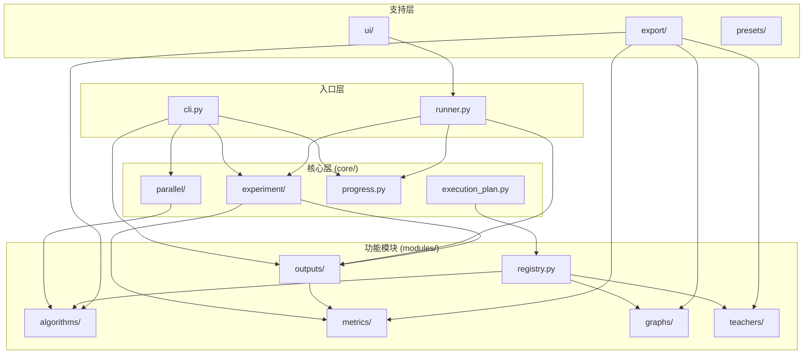

# Matrix_Factorization 项目上下文

> **最后更新**: 2026-01-19
> **供 Agent 在后续会话中快速了解项目结构**

---

## 📁 项目结构

```
Matrix_Factorization/          # 项目根目录
├── .agent/                    # Agent 配置和上下文
├── .vscode/                   # 编辑器配置
├── AGENT.md                   # Agent 全局指令
├── README.md                  # 项目说明
├── pyproject.toml             # Python 包配置 (name: Matrix-Factorization)
│
├── MF/                        # 主包 - CLI 命令: mf
│   ├── __init__.py
│   ├── cli.py                 # CLI 入口点
│   ├── config.yaml            # 默认配置
│   ├── runner.py              # 简化运行入口
│   ├── core/                  # 核心引擎
│   │   ├── experiment/        # 实验生命周期
│   │   │   ├── config.py      # ExperimentConfig
│   │   │   ├── runner.py      # ExperimentRunner
│   │   │   └── result.py      # ExperimentResult
│   │   ├── parallel/          # 并行执行
│   │   │   ├── coordinator.py # 并行协调器
│   │   │   ├── memory_estimator.py # GPU 内存估算
│   │   │   └── batch_checkpoint.py # 断点续传
│   │   ├── progress.py        # 进度显示 (Rich)
│   │   └── execution_plan.py  # 执行计划生成
│   ├── modules/               # 功能模块（可插拔）
│   │   ├── algorithms/        # 算法实现
│   │   │   ├── bigamp.py      # BiG-AMP 基础
│   │   │   └── bigamp_spreading.py # BiG-AMP Spreading
│   │   ├── graphs/            # 图生成器
│   │   ├── teachers/          # Teacher 矩阵生成
│   │   ├── metrics/           # 度量计算
│   │   └── outputs/           # 输出/绘图
│   ├── presets/               # 配置预设
│   │   ├── builtin/           # 内置预设
│   │   └── test/              # 测试配置
│   ├── ui/                    # UI 组件 (可选)
│   ├── export/                # 导出工具
│   └── Replica_results/       # 实验结果 (gitignored)
│
├── docs/                      # 文档
│   ├── api/                   # API 文档
│   ├── reports/               # 分析报告
│   └── METRICS_GUIDE.md       # 指标说明
│
├── scripts/                   # 工具脚本
│   ├── analysis/              # 分析脚本
│   ├── debug/                 # 调试脚本
│   └── verification/          # 验证脚本
│
├── teacher_matrix_analysis/   # 独立分析模块
└── tests/                     # 测试套件
```

---

## 📊 模块依赖关系图



---

## 🔥 热点模块

| 模块 | 被导入次数 | 说明 |
|------|-----------|------|
| `MF.core.experiment` | 5 | 实验配置和运行器 |
| `MF.core.progress` | 3 | 进度显示 |
| `MF.modules.outputs.plotting` | 3 | 绘图功能 |
| `MF.core.parallel.memory_estimator` | 3 | 内存估算 |
| `MF.modules.registry` | 2 | 模块注册表 |

---

## 🛠️ 常用命令

```bash
# 安装包
pip install -e .

# 运行实验
mf                          # 使用默认配置
mf MF/config.yaml           # 使用指定配置
mf --quick                  # 快速测试

# 编辑配置
mf conf

# 恢复中断的实验
mf resume

# 运行测试
pytest tests/
```

---

## 📋 配置流程

```
config.yaml → cli.py → ExperimentConfig → ExperimentRunner → Algorithm
```

**配置层级**:
1. `MF/config.yaml` - 默认配置
2. `MF/presets/builtin/*.yaml` - 内置预设
3. `MF/presets/test/*.yaml` - 测试配置

---

## 🔧 新增模块指南

当前需要修改的文件（待优化为装饰器注册）:
1. 创建 `MF/modules/xxx/new_module.py`
2. 更新 `MF/modules/xxx/__init__.py`
3. 更新 `MF/modules/registry.py`
4. 更新 `MF/core/experiment/config.py` (如需新配置)

---

## 📚 文档索引

- [README.md](file:///home/sucia/Matrix_Factorization/README.md) - 项目简介
- [AGENT.md](file:///home/sucia/Matrix_Factorization/AGENT.md) - Agent 指令
- [docs/api/](file:///home/sucia/Matrix_Factorization/docs/api/) - API 文档
- [docs/METRICS_GUIDE.md](file:///home/sucia/Matrix_Factorization/docs/METRICS_GUIDE.md) - 指标说明

---

*此文件供 Agent 在新会话开始时快速加载项目上下文。*
