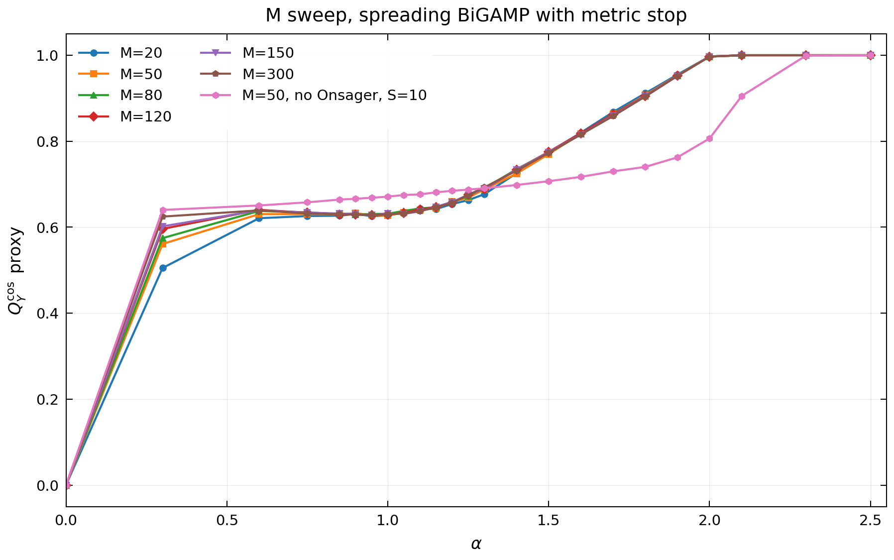
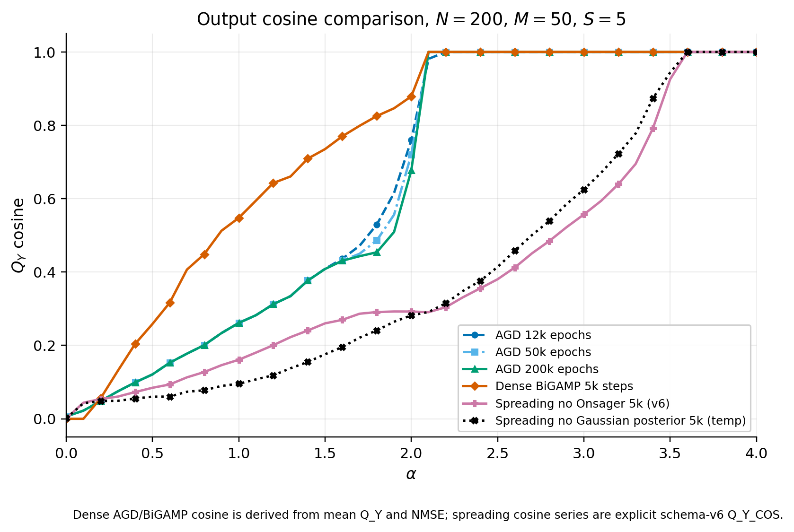

# Matrix_Factorization

这个分支是项目的轻量展示分支，适合发给同学快速查看结果和复现实验入口。完整源码、测试、实验 runner、理论审计和 GPU trial 配置都在 `dev` 分支。

## 展示内容

```text
Matrix_Factorization/
├── README.md
├── parameters/
│   ├── current_local_gpu.yaml
│   ├── qy_compare_200_m50_agd.yaml
│   ├── qy_compare_200_m50_bigamp.yaml
│   └── qy_compare_200_m50_spreading_no_onsager.yaml
└── showcase_results/
    ├── 01_qy_cosine_algorithm_comparison/
    ├── 02_n_sweep_qy_cosine/
    ├── 03_m_sweep_qy_cosine/
    └── 04_spreading_ablation/
```

`runs/`、`results/`、`artifacts/`、tensor checkpoint、`.pt` 大文件和旧 showcase 归档都不放在 `main`。当前展示图只保留 PNG、CSV 和必要参数快照。

## 当前主指标

当前展示优先使用输出层 cosine overlap：

$$
Q_Y^{\cos}
= \frac{\langle \hat Y, Y^\star\rangle}
{\|\hat Y\|_2\|Y^\star\|_2}.
$$

其中 \(Y^\star\) 是 teacher output，\(\hat Y\) 是 student output。dense matrix 路线中 \(\hat Y=\hat W\hat X\)；spreading 路线中 \(\hat Y\) 是使用同一组 spreading 系数 \(F\) 计算的 full-supergraph measurement。

同时保留 projection 形式的 \(Q_Y\) 作为诊断：

$$
Q_Y
= \frac{|\langle \hat Y, Y^\star\rangle|}
{\langle Y^\star,Y^\star\rangle}.
$$

它不裁切；如果 \(\hat Y=2Y^\star\)，则 \(Q_Y=2\)，但 \(Q_Y^{\cos}=1\)。因此展示曲线优先看 \(Q_Y^{\cos}\)，避免把整体 scale mismatch 误读成输出方向恢复。

latent overlap 使用固定分母定义：

$$
Q_W
= \frac{1}{N_1M}\sum_{i,\mu}\hat W_{i\mu}W^\star_{i\mu},
\qquad
Q_X
= \frac{1}{MN_2}\sum_{\mu,j}\hat X_{\mu j}X^\star_{\mu j}.
$$

\(Q_W\) 和 \(Q_X\) 的语义相同，只是分别作用在左右两个 latent factor 上。它们不是 teacher-norm projection；Gaussian teacher 完美恢复时有限尺寸下通常接近 1，但不强制等于 1。

## 主要图片

### 1. AGD / BiGAMP / Spreading 的输出 cosine 对比


这张图重新跑自 `dev` 上的 schema v6 metric。三条曲线分别是：

- `AGD`：\(200\times200, M=50, S=5\)，200000 step。
- `Dense BiGAMP`：同尺寸，5000 step。
- `Spreading BiGAMP, no Onsager`：同尺寸，Ising spreading，5000 step。

这里的 \(Q_Y^{\cos}\) 是原生 `Q_Y_COS_mean`，不是旧 metric 派生值。

### 2. N sweep 的输出 cosine 趋势


这张图来自早停版本的 \(N\) 方向扫描，固定 \(M=50\)，alpha 使用拐点附近更密的 grid C。原始 scan 是 schema v5，只保存了 \(Q_Y\) projection 和 `FIT_Y/NMSE_Y`，因此图中 \(Q_Y^{\cos}\) 是展示用 proxy：

$$
Q_{Y,\mathrm{proxy}}^{\cos}
\approx
\frac{Q_Y}{\sqrt{\mathrm{NMSE}_Y-1+2Q_Y}},
\qquad
\mathrm{NMSE}_Y=1-\mathrm{FIT}_Y.
$$

它只用于展示尺寸趋势；不能和 schema v6 的原生 `Q_Y_COS_mean` 当作完全同一数据源混比。

### 3. M sweep 的输出 cosine 趋势



这张图固定 \(N_1=N_2=2000\)，比较多个 rank \(M\) 的 spreading BiGAMP 结果，并加入一条 `M=50, no Onsager, S=10` 诊断曲线。它同样由 schema v5 的 \(Q_Y\)+`NMSE_Y` 派生 \(Q_Y^{\cos}\) proxy。`M=200` 当时只留下了 \(Q_W\) 诊断 summary，没有完整 \(Q_Y\) final metrics，因此没有放入这张 \(Q_Y^{\cos}\) 图。

### 4. Spreading 更新假设的临时消融



这两张诊断图比较了 production no-Onsager spreading 和一个临时 in-process ablation：在单次运行里去掉高斯 posterior shrinkage 假设，其它配置不变。这个实验没有修改主程序源码，运行后 monkey patch 已恢复。projection 版本也保存在同目录。

## 版本说明

- 当前 `dev` 已把 dense matrix 路线的 `Q_Y_COS_mean` 注册为正式 metric，并通过 contract 测试。
- spreading 路线的 full `Q_Y`/`Q_Y_COS` 是 full-supergraph F-aware measurement，不再使用旧 equal-count heldout full 语义。
- schema v3/v4/v5 的同名 `Q_Y_mean` 不应和当前 schema v6 静默比较；需要同时查看 `metric_schema.schema_version` 和 `metric_definition_profile`。

## 分支角色

- `main`：轻量展示分支，保留图片、CSV、参数快照和简短说明。
- `dev`：完整研究分支，包含源码、测试、文档、trial 配置、GPU 运行流程和最新 metric contract。
