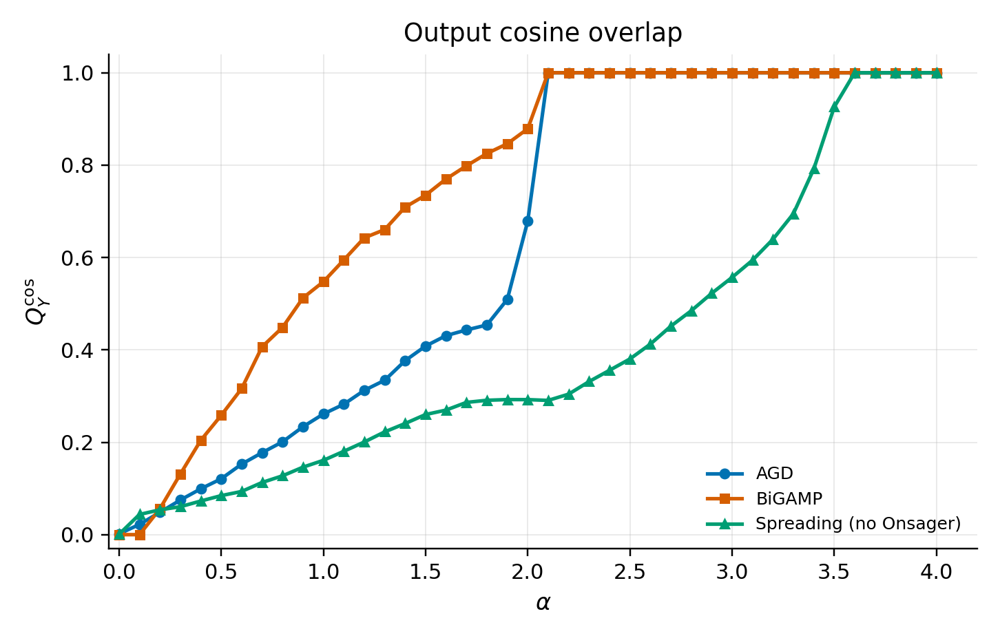
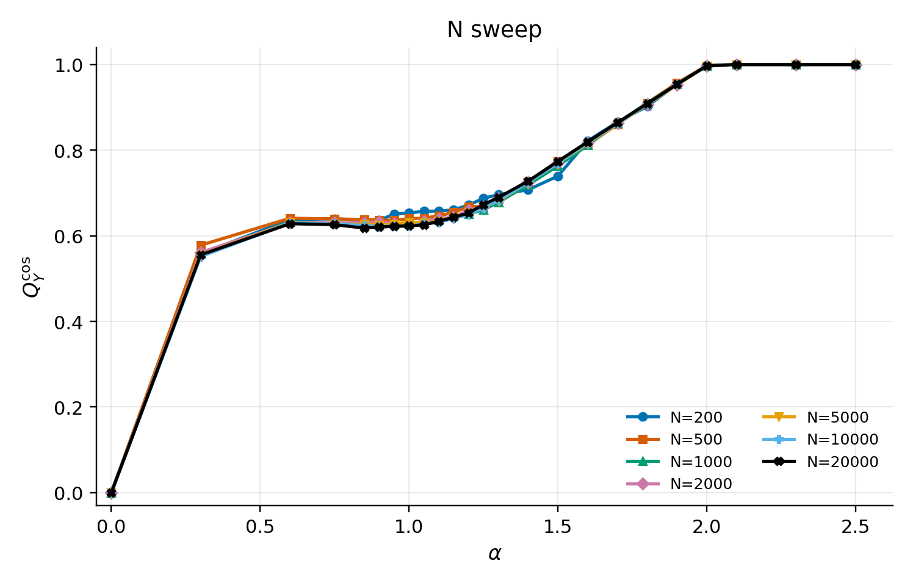
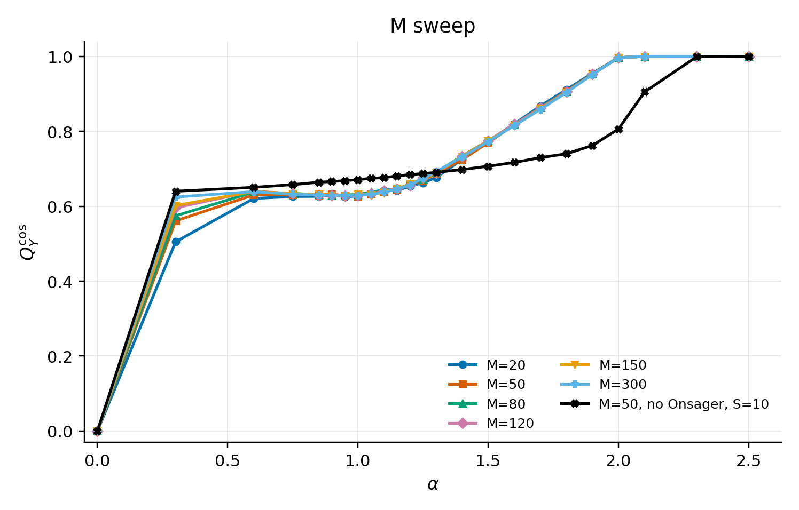

# Matrix_Factorization

This branch is the lightweight sharing branch. It keeps the figures, plotted
CSV files, and a small set of parameter snapshots needed to inspect the current
results. Full source code, tests, runners, audit notes, and GPU trial configs
remain on the `dev` branch.

## Contents

```text
Matrix_Factorization/
├── README.md
├── parameters/
│   ├── current_local_gpu.yaml
│   ├── qy_compare_200_m50_agd.yaml
│   ├── qy_compare_200_m50_bigamp.yaml
│   └── qy_compare_200_m50_spreading_no_onsager.yaml
└── showcase_results/
    ├── 01_qy_cosine_algorithm_comparison/
    ├── 02_n_sweep_qy_cosine/
    ├── 03_m_sweep_qy_cosine/
    └── 04_spreading_ablation/
```

Large run directories, tensor checkpoints, and local experiment artifacts are
not tracked on this branch.

## Main Metric

The main display metric is the output cosine overlap:

```math
Q_Y^{\cos}
= \frac{\langle \hat Y, Y^\star\rangle}
{\|\hat Y\|_2\|Y^\star\|_2}.
```

Here `Y*` is the teacher output and `Y_hat` is the student output. For dense
matrix factorization, `Y_hat = W_hat X_hat`. For spreading BiGAMP, `Y_hat` is
the full output measurement computed with the same spreading matrix `F`.

The projection-style output overlap is still useful as a diagnostic:

```math
Q_Y
= \frac{|\langle \hat Y, Y^\star\rangle|}
{\langle Y^\star,Y^\star\rangle}.
```

This projection is not clipped. If `Y_hat = 2Y*`, then `Q_Y = 2`, while
`Q_Y^cos = 1`. For visual comparisons, `Q_Y^cos` is therefore the safer primary
metric because it focuses on output direction rather than scale mismatch.

The latent overlap uses fixed denominators:

```math
Q_W
= \frac{1}{N_1M}\sum_{i,\mu}\hat W_{i\mu}W^\star_{i\mu},
\qquad
Q_X
= \frac{1}{MN_2}\sum_{\mu,j}\hat X_{\mu j}X^\star_{\mu j}.
```

`Q_W` and `Q_X` have the same meaning on the left and right latent factors.
They are fixed-denominator physical overlaps, not teacher-norm projections.

## Figures

### 1. Algorithm Comparison



This figure compares `AGD`, dense `BiGAMP`, and `Spreading BiGAMP` without
Onsager correction on a 200 x 200 problem with `M=50` and `S=5`. The plotted
column is `Q_Y_COS_mean`.

### 2. N Sweep



This figure fixes `M=50` and compares several square sizes
`N1=N2=N`. The alpha grid is denser near the transition region and sparser on
the low- and high-alpha plateaus. The plotted CSV column is `Q_Y_COS`.

### 3. M Sweep



This figure fixes `N1=N2=2000` and compares several latent ranks `M`. It also
includes a no-Onsager `M=50, S=10` spreading curve as a diagnostic comparison.
The plotted CSV column is `Q_Y_COS`.

### 4. Spreading Ablation


This diagnostic compares production no-Onsager spreading with an in-process
ablation that removes the Gaussian posterior shrinkage assumption.
The main code path was not changed by that ablation run. Both projection and
cosine plots are saved in the same folder.

## Branch Roles

- `main`: lightweight sharing branch with figures, plotted CSV files, parameter
  snapshots, and short explanations.
- `dev`: active research branch with full source code, tests, documentation,
  trial configs, and the current metric contract.
