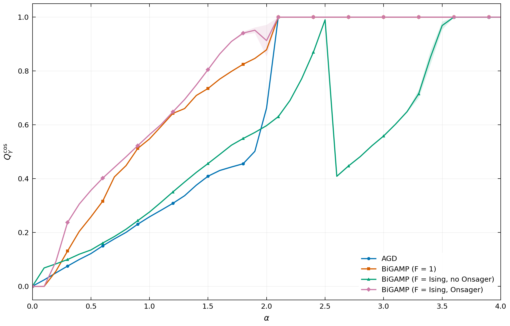
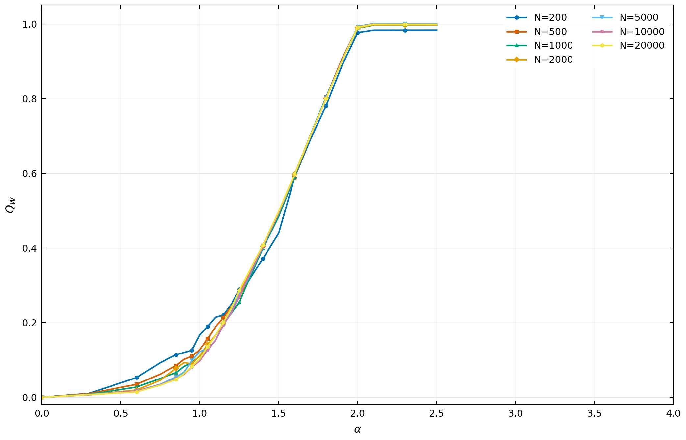
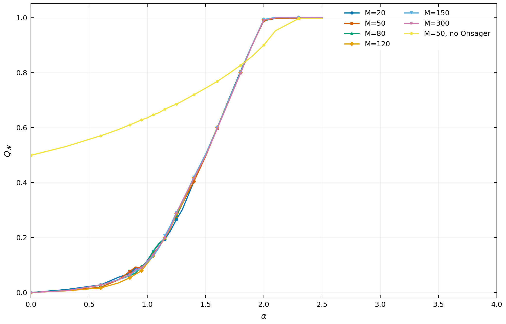

# Matrix_Factorization

This branch is the lightweight sharing branch. It keeps the figures, plotted
CSV files, and a small set of parameter snapshots needed to inspect the current
results. Full source code, tests, runners, audit notes, and GPU trial configs
remain on the `dev` branch.

## Contents

```text
Matrix_Factorization/
├── README.md
├── parameters/
│   ├── current_local_gpu.yaml
│   ├── qy_compare_200_m50_agd.yaml
│   ├── qy_compare_200_m50_bigamp.yaml
│   ├── qy_compare_200_m50_spreading_no_onsager.yaml
│   └── qy_compare_200_m50_spreading_onsager.yaml
└── showcase_results/
    ├── 01_qy_cosine_algorithm_comparison/
    ├── 02_n_sweep_qw/
    └── 03_m_sweep_qw/
```

Large run directories, tensor checkpoints, and local experiment artifacts are
not tracked on this branch.

## Metrics

```math
Q_Y^{\cos}
=
\frac{
\sum_a Y_a Y^{*}_a
}{
\sqrt{
\left(\sum_a Y_a^2\right)
\left(\sum_a (Y^{*}_a)^2\right)
}
}
```

```math
Q_W
=
\frac{1}{N_1 M}
\sum_{i=1}^{N_1}
\sum_{\mu=1}^{M}
W_{i\mu} W^{*}_{i\mu}
```

```math
Q_X
=
\frac{1}{M N_2}
\sum_{\mu=1}^{M}
\sum_{j=1}^{N_2}
X_{\mu j} X^{*}_{\mu j}
```

The current parameter snapshots use `normalization_profile =
paper_sparse_sampling`: teacher latent entries have unit variance, cold-start
student latent entries have unit variance, and the dense output scale is
`1 / sqrt(M)`. For spreading runs,

```math
Y_c
=
\frac{1}{\sqrt{M}}
\sum_{\mu=1}^{M}
F_{c\mu} W_{i(c)\mu} X_{\mu j(c)} .
```

## Figures

### 1. Algorithm Comparison



`N = 200 x 200`, `M = 50`

`initialization = cold start`, `teacher = Gaussian`

Metric: `Q_Y^cos`

Curves: `AGD`, `BiGAMP (F = 1)`,
`BiGAMP (F = Ising, no Onsager)`, `BiGAMP (F = Ising, Onsager)`.

### 2. N Sweep



`M = 50`

`initialization = teacher overlap 0.5`, `teacher = Gaussian`, `F = Ising`,
`Onsager = fixed`

Metric: `Q_W`

### 3. M Sweep



`N = 2000 x 2000`

`initialization = teacher overlap 0.5`, `teacher = Gaussian`, `F = Ising`,
`Onsager = fixed`

Metric: `Q_W`

## Branch Roles

- `main`: lightweight sharing branch with figures, plotted CSV files, parameter
  snapshots, and short explanations.
- `dev`: active research branch with full source code, tests, documentation,
  trial configs, and the current metric contract.
