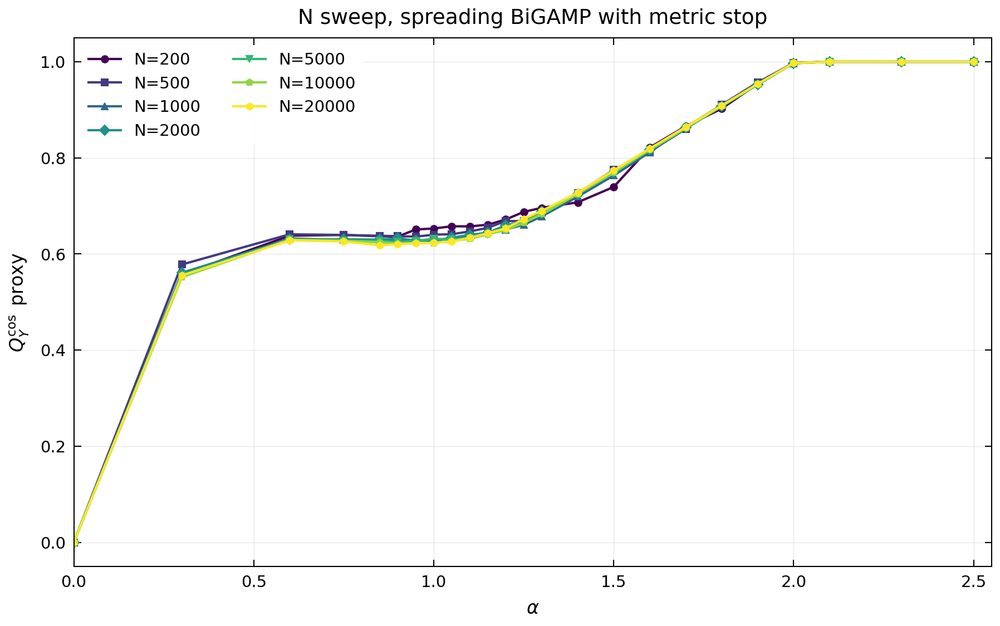

# N Sweep Output Cosine

这张图固定 \(M=50\)，比较不同 \(N_1=N_2=N\) 下的 spreading BiGAMP 曲线。alpha grid 在转折区域更密，平台区域更稀疏。

原始 scan 是 schema v5，没有原生 `Q_Y_COS_mean`，因此这里使用展示用 proxy：

$$
Q_{Y,\mathrm{proxy}}^{\cos}
\approx
\frac{Q_Y}{\sqrt{\mathrm{NMSE}_Y-1+2Q_Y}},
\qquad
\mathrm{NMSE}_Y=1-\mathrm{FIT}_Y.
$$

它只用于观察尺寸扫描的曲线形状；不能替代 schema v6 的原生 full-supergraph `Q_Y_COS_mean`。
